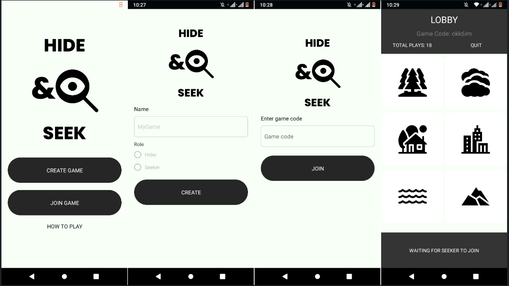

# Hide and Seek Multiplayer Game

Hide and Seek game, where players can hide and seek.

### Hide and Seek Multiplayer Game | Backend

[https://github.com/Lspacedev/hide-and-seek-api](https://github.com/Lspacedev/hide-and-seek-api)

## Prerequisites

- React Native
- Expo
- Socket.io

## Installation

1. Clone the repository

```bash
git@github.com:Lspacedev/hide-and-seek.git
```

2. Navigate to the project folder

```bash
cd hide-and-seek
```

3.  Install all dependencies

```bash
npm install
```

4. Create an env file and add the following:

```bash
API_URL="Server url"
```

5. Run the project

```bash
npx expo start
```

In the output, you'll find options to open the app in a

- [development build](https://docs.expo.dev/develop/development-builds/introduction/)
- [Android emulator](https://docs.expo.dev/workflow/android-studio-emulator/)
- [iOS simulator](https://docs.expo.dev/workflow/ios-simulator/)
- [Expo Go](https://expo.dev/go), a limited sandbox for trying out app development with Expo

## Screenshot



## Features

- Create game.
- Join game.
- Choose role: HIDER OR SEEKER.
- Hide.
- Seek.

## Usage

- Open app.
- Create game.
- Send code to other player.
- Join game.
- If hider, find a place to hide.
- If seeker, find hider.

## Credits

<a href="https://www.freepik.com/icon/business_16623349#fromView=search&page=1&position=26&uuid=998221b0-2f27-4252-9484-475149abfe0d">Icon by iconsmind</a>
<a href="https://www.freepik.com/icon/forest_3238394#fromView=search&page=1&position=20&uuid=e1c40b30-1ab3-42eb-9485-6c835faf8c62">Icon by Freepik</a>
<a href="https://www.freepik.com/icon/smoke_6853958#fromView=search&page=1&position=6&uuid=6b7df295-df80-42a5-9843-c77c7f57cf01">Icon by UIcons</a>
<a href="https://www.flaticon.com/free-icons/sea" title="sea icons">Sea icons created by Freepik - Flaticon</a>
<a href="https://www.flaticon.com/free-icons/city" title="city icons">City icons created by Freepik - Flaticon</a>
<a href="https://www.flaticon.com/free-icons/house" title="house icons">House icons created by Freepik - Flaticon</a>
<a href="https://www.flaticon.com/free-icons/mountain" title="mountain icons">Mountain icons created by Freepik - Flaticon</a>

## Tech Stack / Tools

- React Native
- Socket.io
